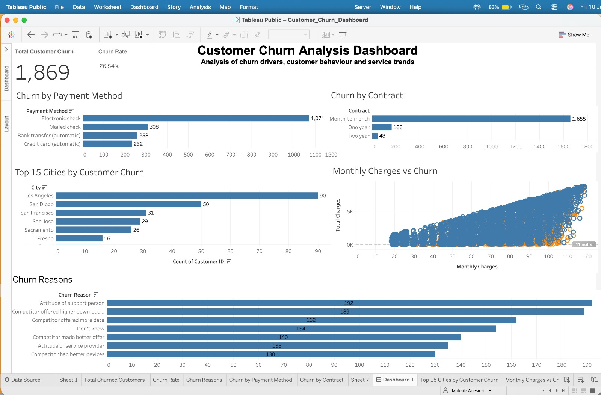
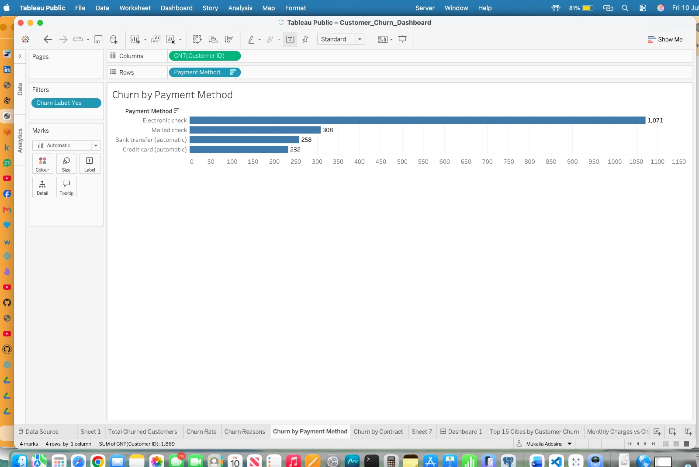
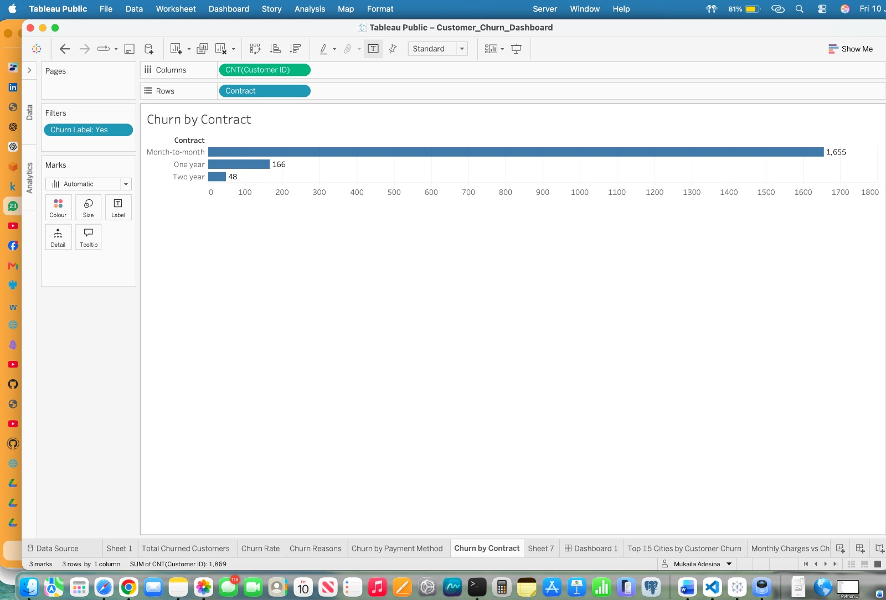
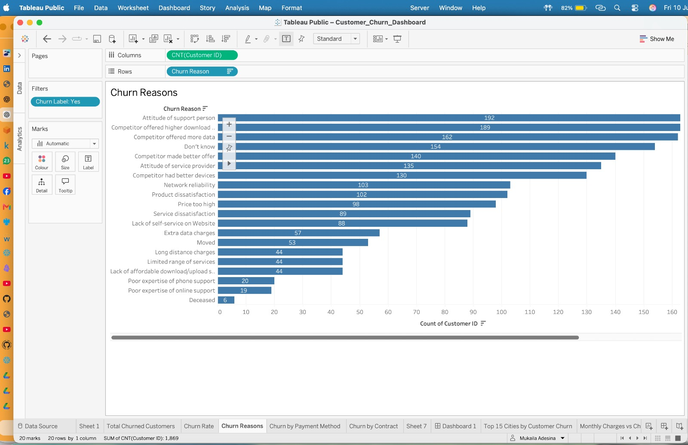

# Customer Churn Analysis Dashboard (Tableau)

## Project Overview

This project analyses customer churn within a telecommunications company using Tableau. The dashboard identifies key drivers of customer attrition by exploring customer demographics, payment methods, contract types, monthly charges, locations and churn reasons.

The objective is to provide business stakeholders with actionable insights that support customer retention strategies, reduce churn and improve customer lifetime value.

---

## Business Problem

Customer churn directly impacts revenue and customer acquisition costs. Understanding why customers leave enables businesses to:

- Identify high-risk customer segments
- Improve customer retention strategies
- Enhance customer experience
- Increase customer lifetime value
- Reduce revenue loss

---

## Dataset

**Source:** IBM Telco Customer Churn Dataset

The dataset contains customer information including:

- Customer demographics
- Contract type
- Internet service
- Payment method
- Monthly charges
- Total charges
- Customer tenure
- Churn status
- Churn reasons

---

## Dashboard Overview

The Tableau dashboard provides interactive analysis through:

- Total Customer Churn KPI
- Churn Rate KPI
- Churn by Payment Method
- Churn by Contract Type
- Top 15 Cities by Customer Churn
- Monthly Charges vs Customer Churn
- Customer Churn Reasons

---

## Key Business Insights

### 1. Month-to-Month Contracts Drive Churn

Customers on month-to-month contracts account for the majority of customer churn, suggesting that shorter contract commitments significantly increase churn risk.

### 2. Electronic Check Customers Churn Most

Electronic Check is the payment method with the highest number of churned customers, indicating an opportunity to investigate customer payment behaviour and improve retention initiatives.

### 3. Higher Monthly Charges Increase Churn Risk

Customers paying higher monthly charges are more likely to churn, suggesting pricing sensitivity and perceived value influence customer retention.

### 4. Customer Service Matters

The leading churn reasons include:

- Attitude of support person
- Competitor offers
- Better data packages
- Better service quality

This highlights customer experience as a major business priority.

### 5. Geographic Hotspots

Several cities consistently report higher customer churn, enabling targeted retention campaigns and regional customer engagement strategies.

---

## Dashboard Features

- Interactive visualisations
- KPI summary cards
- Customer segmentation
- Contract analysis
- Payment behaviour analysis
- Geographic analysis
- Customer behaviour insights

---

## Technologies Used

- Tableau Public
- Data Visualisation
- Business Intelligence
- Dashboard Design
- Data Analysis

---

## Skills Demonstrated

- Business Intelligence
- Dashboard Development
- KPI Design
- Data Storytelling
- Customer Analytics
- Churn Analysis
- Interactive Reporting
- Data Visualisation

---

## Dashboard Preview

### Customer Churn Dashboard



---

### Churn by Payment Method 
 

--- 

### Churn by Contract  

--- 

### Customer Churn Reasons 


## Tableau Public Dashboard

**Live Dashboard:**

https://public.tableau.com/app/profile/mukaila.adesina/viz/Customer_Churn_Dashboard_17834239607730/Dashboard1?publish=yes

---

## Repository Structure

```
Customer-Churn-Tableau/
│
├── README.md
├── Customer_Churn_Dashboard.twbx
├── Telco_customer_churn.xlsx
├── dashboard.png
├── churn_payment_method.png
├── churn_contract.png
├── churn_reason.png
└── monthly_charges_vs_churn.png
```

---

## Author

**Mukaila Adesina**

Data Engineer | Business Intelligence Developer | Analytics Engineer

GitHub:
https://github.com/madesina2025
